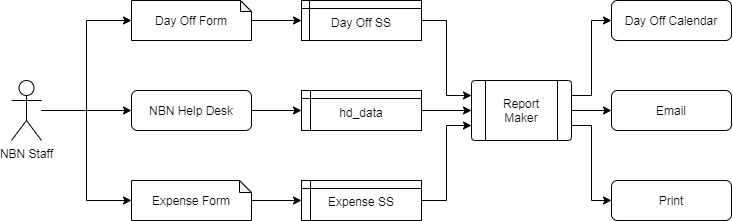

# NBN Accounting Project

    
The **NBN Accounting Project** is made up of Google Apps designed to supplement the NBN Help Desk accounting and scheduling processes used by the accountants and management. NBN staff report their hours through the Help Desk, but the Help Desk can only export a large and difficult to read file that does not include expenses or days off.

## Built With

<a href="https://developers.google.com/apps-script">Google Apps</a>

## Objective

>**A) Parse the pay period data and create human-readable reports**

>**B) Process expenses & days off**

## Roles and Responsibilities 

* **NBN Staff**: need to report hours, expenses and days off

* **NBN Help Desk**: facilitates communication between staff and processes hours; exports raw data for pay period (`hd_data`)

### Supplementary Tools
* Expense Processing
    * **Expense Form**: allows NBN staff to report expenses; writes to Expense Spreadsheets (ss)
    * **Expense ss**: stores expenses
    
* Day Off Processing
    * **Day Off Form**: allows NBN staff to report days off; writes to Day Off ss
    * **Day Off ss**: stores days off
    * **Day Off Calendar**: displays days off

* **Report Maker Script**: reads `hd_data`, Expense ss and Day Off ss to create human-readable reports that can be printed and/or emailed; writes data from Day Off ss to Day Off Calendar

