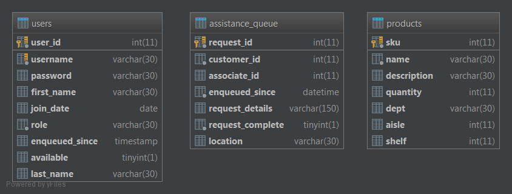

# Retail Alert

    
As we continue into the age of technology, ecommerce and online shopping are becoming more and more prevalent. Amazon is the long-reigning king of retail, competing with both physical and digital retailers for every piece of the market share. Customers are demanding a faster and easier shopping experience, and more often than not customers will simply go home and buy online instead of looking around and trying products on in a store. There are also people who have forsaken physical shopping entirely because of the inconvenience and time cost incurred by navigating the store and being pestered by the ever-present store associates. Simultaneously, the time of the store associates, and by extension the time of the company, is being wasted when it could be better spent on attending a customer that needs assistance or by closing a sale. 

Our app caters to both the retail company and the retail consumer by allowing the consumer to identify themselves as either “in need of assistance” or “do not disturb”. This creates an environment where the consumer can shop in a pressure-free manner, and the associate’s time is spent more efficiently on customers who need help. 

A retailer of any size can benefit from our product. Our app will generate revenue via advertisements and commissions to cover overhead costs and create profit for investors.

## Built With

* <a href="https://www.php.net/docs.php">PHP</a>
* <a href="https://dev.mysql.com/doc/">MySQL</a>

## Database

### Schema

### SQL
[create_tables.sql](401-RESOURCES/create_tables.sql)

[data_inserts.sql](401-RESOURCES/data_inserts.sql)

## Features

### Customer Management
Customers can add themselves to the queue of customers waiting to be helped (assistance queue).
Store Associates can view the assistance queue and remove customers from it.

### Product Lookup
Customers can search the store's catalog and easily add themselves to the assistance queue.

## Operation

<h3>Use Case 1 Walkthrough: Customer Management</h3>

    <table style="width:80%;margin: auto 10% 50px 10%" class="table table-striped table-hover">
        <thead class="thead-dark">
            <tr style="width: 100% ">
                <th style="width: 10%">Step</th>
                <th style="width: 20%">Role</th>
                <th>Instructions</th>
            </tr>
        </thead>
        <tr>
            <td>1</td>
            <td>--</td>
            <td>Begin by navigating to the Admin Controls page and logging in to the customer1 account</td>
        </tr><tr>
            <td>2</td>
            <td>Customer</td>
            <td>Select a department, input the details of the request and click the big red "I NEED HELP!" button</td>
        </tr><tr>
            <td>3</td>
            <td>Customer</td>
            <td>After submitting the request, navigate back to the Admin Page and log in to the associate1 account. Note that the unclaimed request is visible in the Assistance Queue on the Admin Page</td>
        </tr><tr>
            <td>4</td>
            <td>Associate</td>
            <td>Click on the "Claim" button and return to the Admin Page. Notice that the request is claimed in the Assistance Queue</td>
        </tr><tr>
            <td>5</td>
            <td>Associate</td>
            <td>Go back to associate1's page and click on the "Mark Completed" button. On the Admin Page, notice that the request is removed from the Assistance Queue</td>
        </tr><tr>
            <td>6</td>
            <td>Customer</td>
            <td>From the Admin Page, log back in to customer1's account and notice that they are no longer waiting for an associate</td>
        </tr>
    </table>

<h3>Use Case 2 Walkthrough: Product Lookup</h3>

    <table style="width:80%;margin: auto 50px auto 10%" class="table table-striped table-hover">
        <thead class="thead-dark">
        <tr style="width: 100% ">
            <th style="width: 10%">Step</th>
            <th style="width: 20%">Role</th>
            <th>Instructions</th>
        </tr>
        </thead>
        <tr>
            <td>1</td>
            <td>--</td>
            <td>Go to the Admin Controls Page and log into customer1's account</td>
        </tr><tr>
            <td>2</td>
            <td>Customer</td>
            <td>From customer1's page, click on the "Search Products" button</td>
        </tr><tr>
            <td>3</td>
            <td>Customer</td>
            <td>Choose "Any Department" and type in "5" for the keyword. The result should be womens shoes, size 11, etc.  <em>The system returns the row if the keyword is found in the name, sku, or description columns</em></td>
        </tr><tr>
            <td>4</td>
            <td>Customer</td>
            <td>Click the orange "Help" button to send a product-specific request to the Assistance Queue</td>
        </tr><tr>
            <td>5</td>
            <td>Associate</td>
            <td>Navigate to the Admin Page and log in to associate1's account. Notice the new unclaimed product-specific request with the relevant location</td>
        </tr>
    </table>

