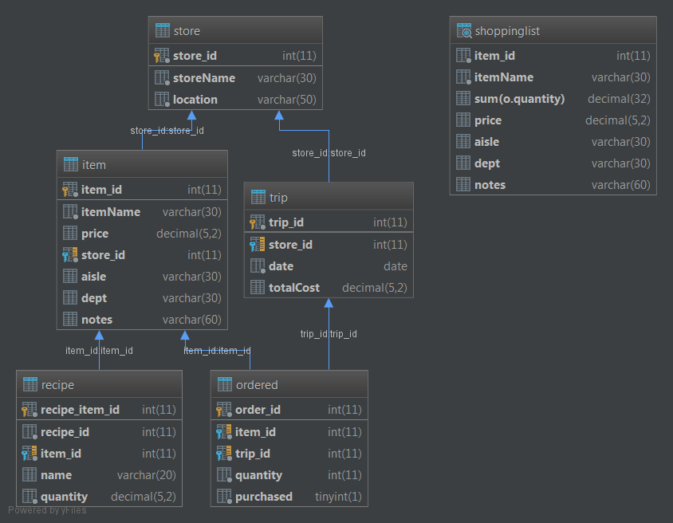
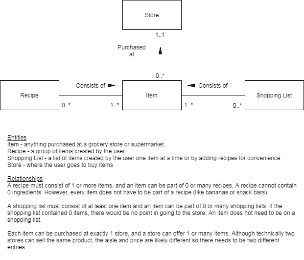

# Shopping List Project

    
The **Shopping List Project** allows you to create a simple shopping list using a database and Java's standard input and output streams.

## Built With

* <a href="https://docs.oracle.com/en/java/index.html">Java</a>
* <a href="https://dev.mysql.com/doc/">MySQL</a>

## Database
### Schema

### ER Diagram
